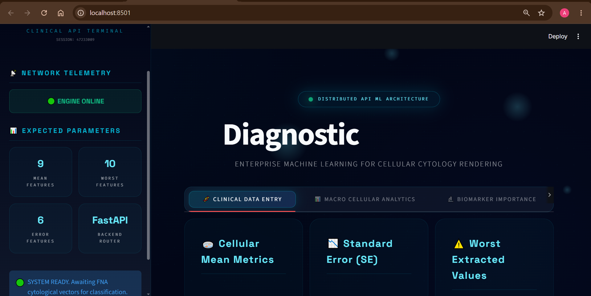
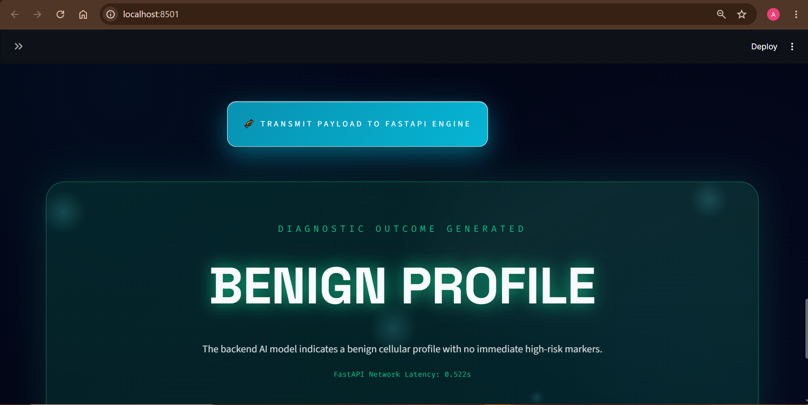
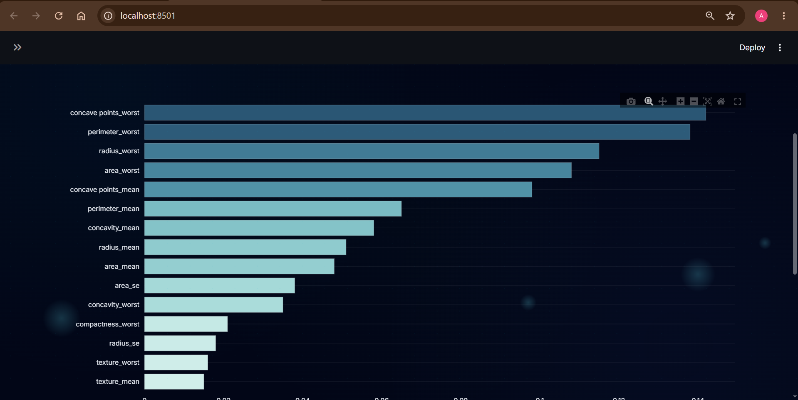

# 🧬 ONCO-SYS: Cancer Prediction System

#UI

An enterprise-grade, distributed AI microservice designed to predict breast cancer malignancy using digitized Fine Needle Aspirate (FNA) cytology data. 

This project completely decouples the machine learning inference engine from the user interface. It utilizes a cloud-hosted **FastAPI** backend to serve the machine learning model and a deeply interactive, heavily animated **Streamlit** frontend to process inputs, visualize cytological deviations, and generate exportable medical artifacts.

## 🌐 Live API Documentation (FastAPI & Render)
The machine learning backend is currently live and deployed via Render. You can interact directly with the Swagger UI documentation and test the `POST` endpoints here:
* **Interactive API Docs (Swagger UI):** [https://cancer-prediction-system-4.onrender.com/docs](https://cancer-prediction-system-4.onrender.com/docs)
* **Prediction Endpoint:** `https://cancer-prediction-system-4.onrender.com/docs#/default/predict_cancer_predict_post`

## ✨ Core Architecture & Features

* 📡 **Distributed Microservice:** The frontend operates independently from the heavy ML dependencies, communicating securely via REST API `POST` requests to the live FastAPI inference endpoint.
* 🧫 **25-Dimensional Biomarker Analysis:** Processes precise cytological measurements (Mean, Standard Error, and Worst Extremities) including radius, texture, perimeter, area, smoothness, and concavity.
* 📊 **Macro Cellular Analytics:** Generates dynamic, real-time Radar Charts and Deviation Bar Graphs comparing the inputted tumor profile against baseline benign physiological markers.
* 🎨 **Immersive Animated UI:** Features a custom CSS "Medical Neural" theme with glassmorphism panels, cellular floating particle animations, and pulsing diagnostic alert cards.
* 💾 **Clinical Telemetry Export:** Allows users to download session payloads, raw JSON API responses, and structured CSV reports of the diagnostic session.

## 🏗️ Repository Structure
All application logic, APIs, and model artifacts are maintained in a streamlined, flat directory architecture:

📦 cancer-prediction-system

     ┣ 📜 app.py                  # Streamlit Animated Dashboard (Frontend UI)
     ┣ 📜 main.py                 # FastAPI Application Router & API Endpoints
     ┣ 📜 model.py                # Backend ML Model Loading & Inference Logic
     ┣ 📜 schema.py               # Pydantic Schemas for API Payload Validation
     ┣ 📜 best_model.pkl          # Serialized ML Classification Model
     ┣ 📜 scaler.pkl              # Pickled Data Scaler for Feature Preprocessing
     ┣ 📜 feature_columns.pkl     # Pickled List of Expected Feature Columns
     ┣ 📜 breast-cancer.csv       # Source Dataset used for EDA and Training
     ┣ 📜 requirements.txt        # Combined Global Project Dependencies
     ┣ 📜 runtime.txt             # Python Runtime Version for Cloud Deployment
     ┣ 📜 .gitignore              # Git Ignore Directives
     ┗ 📜 README.md               # Project Documentation

🚀 Local Installation & Setup

1. Clone the repository
   
       git clone [https://github.com/akshitgajera1013/cancer-prediction-system.git](https://github.com/akshitgajera1013/cancer-prediction-system.git)

       cd cancer-prediction-system

2. Create the Virtual Environment
   
Create a single, unified environment to run both the API and the UI:

    python -m venv venv
    
    # Windows Activation:
    venv\Scripts\activate
    
    # Mac/Linux Activation:
    source venv/bin/activate

3. Install Dependencies

       pip install -r requirements.txt

4. Boot the Animated Terminal (Frontend)
   
Ensure your virtual environment is active, then launch the UI:

    streamlit run app.py

☁️ Cloud Deployment Status
Backend (Inference Engine): Deployed autonomously on Render using FastAPI. The API enters a cold-sleep state when inactive to conserve server resources and requires ~50 seconds to boot upon the first diagnostic request.

Frontend (Terminal UI): Designed for deployment on Streamlit Community Cloud.

Disclaimer: This software is an educational portfolio project simulating machine learning architectures. It is not an FDA-approved medical device and should not be used for actual clinical diagnostic purposes.
